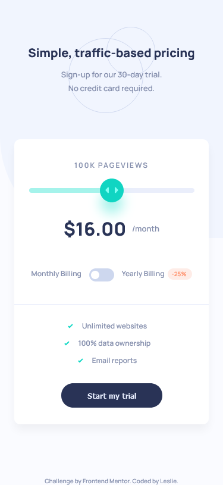
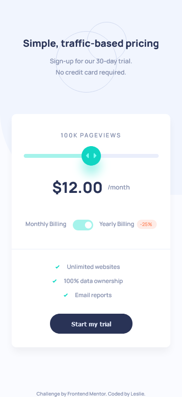
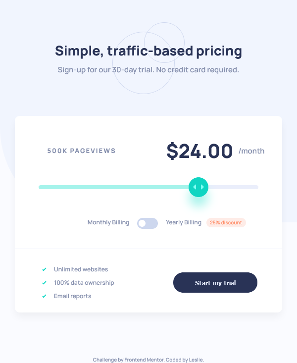
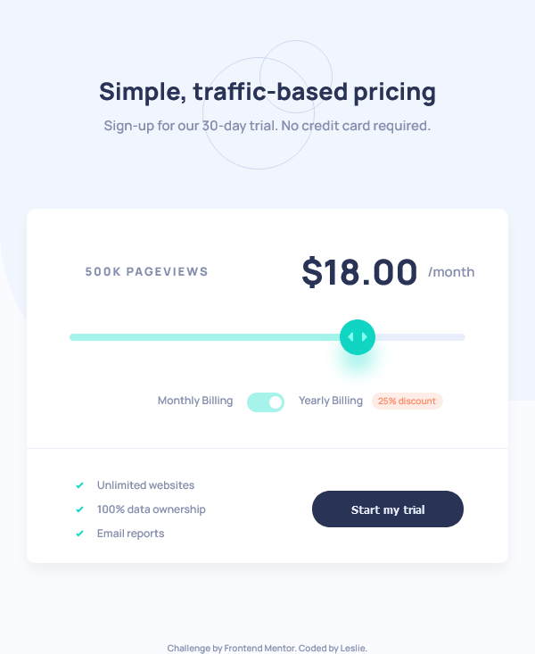

# Frontend Mentor - Interactive pricing component solution

This is a solution to the [Interactive pricing component challenge on Frontend Mentor](https://www.frontendmentor.io/challenges/interactive-pricing-component-t0m8PIyY8). Frontend Mentor challenges help you improve your coding skills by building realistic projects. 

## Table of contents

- [Overview](#overview)
  - [The challenge](#the-challenge)
  - [Screenshot](#screenshot)
  - [Links](#links)
- [My process](#my-process)
  - [Built with](#built-with)
  - [What I learned](#what-i-learned)
  - [Continued development](#continued-development)
  - [Useful resources](#useful-resources)
- [Author](#author)

## Overview

### The challenge

Users should be able to:

- View the optimal layout for the app depending on their device's screen size
- See hover states for all interactive elements on the page
- Use the slider and toggle to see prices for different page view numbers

### Screenshot

### Links

- Live Site URL: [Interactive pricing component](https://leslief10.github.io/interactive-pricing-component/)

## My process

### Built with

- Semantic HTML5 markup
- CSS custom properties
- Flexbox
- CSS Grid
- Mobile-first workflow
- JavaScript

### What I learned

With this project, I learned that inputs with type range are a pain to customize for different browsers. I don't get why for webkit there isn't a range-progress pseudoelement like with Mozilla. Besides that, I learned how to make a toggle switch from scratch which is always helpful. 

### Continued development

I want to make the JS code a bit less wonky. Right now, you need to click on the slider for it to show the right price, and on webkit browsers to show the range track.

### Useful resources

- [Creating A Custom Range Input That Looks Consistent Across All Browsers](https://www.smashingmagazine.com/2021/12/create-custom-range-input-consistent-browsers/) - This helped me to create the custom range input.
- [How To Create a Toggle Switch](https://www.w3schools.com/howto/howto_css_switch.asp) - This helped me to create the toggle switch.
- [How to style HTML5 range input to have different color before and after slider?](https://stackoverflow.com/questions/18389224/how-to-style-html5-range-input-to-have-different-color-before-and-after-slider) - One of the replies in this thread helped me with the styling of the range input for webkit.

## Author

- Website - [Leslie Fernandez](https://github.com/leslief10)
